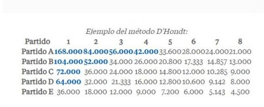

```{r include=FALSE}
knitr::opts_chunk$set(
  fig.path = "figurasR/",
  echo = FALSE, warning = FALSE, message = FALSE,
  fig.pos = "H", fig.align = "center", out.width = "95%",
  cache = FALSE
)
```


<!-- \setcounter{chapter}{2} -->
<!-- \setcounter{chapter}{2} escribir 2 para capítulo 3  -->
<!-- \pagenumbering{arabic} -->

\ifdefined\ifprincipal
\else
\setlength{\parindent}{1em}
\pagestyle{fancy}
\setcounter{tocdepth}{4}
\tableofcontents
<!-- \nocite{*} -->
\fi

\ifdefined\ifdoblecara
\fancyhead{}{}
\fancyhead[LE,RO]{\scriptsize\rightmark}
\fancyfoot[LO,RE]{\scriptsize\slshape \leftmark}
\fancyfoot[C]{}
\fancyfoot[LE,RO]{\footnotesize\thepage}
\else
\fancyhead{}{}
\fancyhead[RO]{\scriptsize\rightmark}
\fancyfoot[LO]{\scriptsize\slshape \leftmark}
\fancyfoot[C]{}
\fancyfoot[RO]{\footnotesize\thepage}
\fi
\renewcommand{\headrulewidth}{0.4pt}
\renewcommand{\footrulewidth}{0.4pt}


# Métodos de reparto de escaños


## Método de los promedios mayores 

  El método de los promedios mayores son un conjunto de fórmulas electorales utilizadas para asignar escaños en sistemas de representación proporcional por listas electorales. El número de votos obtenidos por cada partido se divide sucesivamente por una serie de divisores. Esto produce una tabla de cocientes, o promedios, con una fila para cada divisor y una columna para cada partido. El enésimo escaño se asigna al partido cuya columna contiene la enésima entrada más grande en esta tabla, hasta el número total de escaños disponibles. 
  
Dentro de los llamados métodos de los restos mayores, se encuentran el método D`Hondt, el Método Sainte-Laguë, Imperiali, Huntington–Hill, Danish y Adams.

### Método D´Hondt

El método D´Hondt lleva el nombre del matemático y jurista belga Victor D´Hondt , el cual describió la metodología en el año 1878 en su libro *"La représentation proportionnelle des partis par un électeur"*. [^3.1]

[^3.1]: Puede leerse en línea el segundo libro del autor: *"Système pratique et raisonné de représentation proportionelle"* en  http://mat.uab.cat/~xmora/bibliografia/DHondt1882.pdf

  Se trata de un método de promedio mayor, utilizado para asignar los escaños usualmente en sistemas de listas. Es un sistema que trata de asignar los escaños aproximados al número de votos recibidos y que incentiva las coaliciones de partidos.  

 
```{r pressure, echo=FALSE, fig.cap="Método D´Hondt", out.width = '100%'}
 

```
<!-- {width="687"} -->

  Es el sistema más habitualmente utilizado en las democracias actuales. Utilizado en países como Albania, Argentina, Austria, Bélgica, Bolivia, Brasil, Bulgaria, Camboya, Cabo Verde, Chile, Colombia, Croacia, República Checa, República Dominicana, Ecuador, Escocia, Eslovenia, España, Estonia, Finlandia, Gales, Guatemala, Hungría, Islandia, Israel, Japón, Kosovo, Luxemburgo, Macedonia, Moldavia, Montenegro, Países Bajos, Paraguay, Perú, Polonia, Portugal, Rumanía, Serbia, Timor del Este, Turquía, Uruguay y parcialmente en Venezuela.

#### Reparto

Una vez escrutados la totalidad de los votos, se calculan cocientes según la fórmula:  

$\textrm{Cociente} = \frac{V}{s+1}$  donde:  

$V$: Representa el número total de votos recibidos por la lista.  

$s$: Representa el número de escaños que cada lista se ha llevado de momento, inicialmente 0 para cada lista.  

El número de votos recibidos por cada lista se divide primero por 1, después por 2, 3, hasta el número total de escaños para ese distrito. La asignación de escaños se hace ordenando los cocientes de mayor a menor y asignando a cada uno un escaño hasta que estos se agoten.


### Método Sainte-Laguë

Método también conocido como método Webster, creado por el matemático francés André Sainte-Laguë en 1832, similar al método D`Hondt. Es un método de promedios mayores, utilizado en sistemas de votación proporcional por listas.   
El método de Sainte-Laguë es utilizado en una gran cantidad de países en los que en la actualidad [^4.2] se encuentran, entre otros, estados como Noruega, Iraq y Nueva Zelanda.  
 
[^4.2]: Cierto a la fecha de realización del trabajo.

#### Reparto 

Una vez escrutados la totalidad de los votos, se calculan cocientes según la fórmula:  

$\textrm{Cociente} = \frac{V}{2s+1}$  donde:  

$V$: Representa el número total de votos recibidos por la lista.  

$s$: Representa el número de escaños que cada lista se ha llevado de momento, inicialmente 0 para cada lista.  

El número de votos recibidos por cada lista se divide sucesivamente por cada uno de los valores que da la fórmula 2s+1 cuando s es igual a 0, 1, 2, 3, etc.; lo que supone dividir por 1, 3, 5, 7, etc. (es decir, la sucesión de números impares). La asignación de escaños se hace ordenando los cocientes de mayor a menor y asignando a cada uno un escaño hasta que estos se agoten. A diferencia de otros sistemas, el número total de votos no interviene en el cómputo.

### Método Sainte-Laguë modificado

  Método utilizado en algunos países como Nepal o Suecia. Consiste en utilizar una fórmula distinta para el primer escaño y a partir del segundo utilizar el método habitual. Así, el método modificado cambia la secuencia de divisores de (1, 3, 5, 7, ...) a (1.4, 3, 5, 7, ...). Esto da una preferencia ligeramente mayor a los partidos más grandes sobre los partidos más pequeños que ganarían, por un pequeño margen, un solo escaño si se utilizara el método de Sainte-Laguë sin modificar. Con el método modificado, estos partidos pequeños no obtienen representación, en cambio, estos escaños se le otorgan a un partido más grande. La forma para el primer escaño es:

$\textrm{Cociente[s=0]} = \frac{V}{1.4}$ donde:  

$V$: Representa el número total de votos recibidos por la lista.

### Método Imperiali

Otro método de promedio mayor se llama Imperiali  (no debe confundirse con la cuota Imperiali, que es un método del resto mayor). Los divisores son 1, 1.5, 2, 2.5, 3, 3.5 y así sucesivamente. Está diseñado para desfavorecer a los partidos más pequeños. Este método (a diferencia de otros métodos enumerados) no es estrictamente proporcional, si es que existe una asignación perfectamente proporcional, mediante este método no se garantiza encontrarla. 
Método utilizado en Bélgica en las elecciones municipales.[^5]

[^5]: *BJPS1992.pdf* , \<<https://www.tcd.ie/Political_Science/people/michael_gallagher/BJPS1992.pdf>\> [accessed 4 May 2021]

### Método Huntington-Hill

Método creado en 1920 por Joseph Hill y corregido por el compañero de escuela de Hill, Edward Huntington. Actualmente se utiliza para distribuir los asientos que les corresponde a cada estado en la cámara de representantes de los Estados Unidos de América.
El objetivo es mantener la relación de "una persona un voto" lo más cercana posible a 1.

#### Cálculo

Para distribuir los asientos entre los distintos partidos se utiliza el divisor según $\sqrt{n(n-1)}$. Los primeros divisores son 0, 1.41, 2.45, 3.46, 4.47. La asignación de escaños se hace ordenando los cocientes de mayor a menor y asignando a cada uno un escaño hasta que estos se agoten.

Para repartir los asientos por estado se utiliza el siguiente método:

I. Calculamos D: $\textrm{D} = \frac{Población Total}{NúmeroTotalDiputados}$

II. Calcular la cuota de diputados por estado:  

$CoutaEstado = \frac{Población Estado}{D}$

III. Redondeamos la cuota a la parte entera.  

$\textrm{n} = ParteEntera\left\{{Cuota Estado}\right\}$

IV. Comparar la Cuota del estado con la media geométrica de $n$ y $n+1$, $\sqrt{n(n+1)}$

Si $\begin{cases}CuotaEstado>MediaGeométrica & Representantes = n+1\\\textrm{Caso Contrario} & Representantes = n\end{cases}$

Ajustar D para que el número de asientos totales coincida con el número total de asientos designados.

### Método Danish

El método danés[^1] se utiliza en las elecciones danesas para asignar los escaños de cada partido a nivel de provincia electoral. Divide el número de votos recibidos por un partido en una circunscripción de varios miembros por los divisores que aumentan de tres en tres (1, 4, 7, 10, etc.). También, dividir los números de votos por 0.33, 1.33, 2.33, 3.33, etc. da el mismo resultado. Este sistema intenta deliberadamente asignar escaños por igual en lugar de proporcionalmente.

[^1]: Wikipedia contributors, 'Highest averages method', *Wikipedia, The Free Encyclopedia,* 31 December 2020, 20:02 UTC, \<<https://en.wikipedia.org/w/index.php?title=Highest_averages_method&oldid=997495824>\> [accessed 4 May 2021]

### Método Adams

El método de Adams fue concebido por John Quincy Adams para distribuir los escaños de la Cámara entre los distintos estados. Otorga un escaño al partido que tiene más votos por escaño antes de que se agregue el escaño.

El método de Adams usa $n-1$ como divisor. La secuencia de los cinco primeros divisores serían (0,1,2,3,4). Al igual que el método Huntington-Hill, esto da como resultado un valor de 0 para los primeros escaños que se designarán para cada partido, lo que da como resultado un promedio de $\infty$. 

Sin umbral, todos los partidos que han recibido al menos un voto, también reciben un escaño, con la obvia excepción de los casos en los que hay más partidos que escaños. Esta propiedad puede ser deseable, por ejemplo, al distribuir escaños entre distritos electorales. Siempre que haya al menos tantos escaños como distritos, todos los distritos estarán representados. En una elección de representación proporcional por lista de partidos, puede resultar en que partidos muy pequeños obtengan escaños. Las violaciones de la regla de la cuota en el método puro de Adams son muy comunes. Estos problemas pueden resolverse mediante la introducción de un umbral electoral.


<!-- El método de Adams[^1] divide toda las población por un divisor modificado y luego redondea los resultados a la cuota superior del siguiente modo: -->

<!-- [^1]: [\^1]: Anon, 2021. Apportionment - Jefferson's, Adams's, and Webster's Methods. Available at: [[https://math.libretexts.org/\\\@go/page/31996](https://math.libretexts.org/\@go/page/31996)](https://math.libretexts.org/\@go/page/31996](https://math.libretexts.org/@go/page/31996)) [Accessed May , 2021]. -->

<!-- 1.  Obtener el divisor estándar: ${SD={\frac {Población Total}{Núm.Asientos}}}$ -->

<!-- 2.  Escoger un divisor modificado, *d,* que sea un poco mayor que el divisor estándar. -->

<!-- 3.  Dividir el número de votantes de cada partido por el divisor modificado para obtener la cuota modificada. -->

<!-- 4.  Redondear la cuota modificada hasta la cuota superior. -->

<!-- 5.  Sumar las cuotas superiores -->

<!-- 6.  Si la suma es la misma que la cantidad de asientos que se distribuirán, ya está. Si la suma es demasiado grande, elija un nuevo divisor modificado que sea mayor que *d*. Si la suma es demasiado pequeña, elija un nuevo divisor modificado que sea más pequeño que *d*. -->


## Método del resto mayor

Es un método para distribuir los escaños proporcionalmente para un sistema de listas de partidos. Son una alternativa a los métodos de promedio mayor. 

El método del resto mayor requiere que el número de votos de cada partido se divida por una cuota que represente el número de votos necesarios para un escaño (es decir, normalmente el número total de votos emitidos dividido por el número de escaños, o alguna fórmula similar). El resultado para cada partido consistirá normalmente en la parte entera más un resto. A cada partido se le asigna primero un número de escaños igual a su número entero. Esto generalmente dejará algunos escaños sin asignar: los partidos se clasificarán entonces sobre la base de los restos, y a los partidos con los restos más grandes se les asigna cada uno un escaño adicional hasta que se hayan asignado todos los escaños. De ahí el nombre del método.
Hay distintos modelos para calcular el cociente, los más utilizados son el cociente Hare, Droop e Imperiali.

### Cociente Droop

Algunos países que emplean este cociente son Australia Irlanda o Malta, entre otros.
Es más favorable a los partidos mayoritarios que el obtenido mediante el sistema Hare, aunque no favorece tanto como el sistema Imperiali.


Si se eligen ${n}$ escaños para un cuerpo colegiado, y se emiten ${m}$ votos válidos, se establece un cociente ${q}$ el cual utilizaremos para repartir los votos. Este cociente se calcula mediante la fórmula:

${q=1+{\frac {m}{n+1}}}$  con $q$ aproximado al entero más próximo.

Si la i-ésima lista de I listas inscritas obtiene ${m_{i}}$ votos, esta lista tendrá ${e_{i}}$ escaños por cociente y ${r_{i}}$ votos por residuo mediante la fórmula: ${m_{i}=qe_{i}+r_{i}}$

${e_{i}=\left\lfloor {\frac {m_{i}}{q}}\right\rfloor ,r_{i}=m_{i}-qe_{i}}$

Definimos k como el número de escaños restantes que no son obtenidos por el cociente:

${k=n-\sum _{i=1}^{I}e_{i}}$

Estos k escaños son repartidos entre los mejores k residuos ${r_{i}}$.

De esta forma, el número total de escaños del i-ésimo partido será ${p_{i}=e_{i}}$ o ${p_{i}=e_{i}+1}$.


### Cociente Hare

La fórmula del cociente Hare es la fórmula más simple que puede utilizarse en unas elecciones según un sistema de voto transferible único, también se utiliza en sistemas de representación proporcional por listas. En comparación con algunos métodos similares, la utilización del método del cociente de Hare con el método de resto mayor tiende a favorecer a las partes más pequeñas a expensas de las más grandes. 

- Fórmula:

  El cociente se calcula mediante la siguiente fórmula y se siguen los pasos explicados anteriormente para el cociente Droop:
  
$Cociente = \frac{Total Votos}{Total Escaños}$ 
  

### Cociente Imperiali

El reparto es más favorable a los partidos mayoritarios que el que se pueda obtener mediante los métodos de Hare o Droop.

- Reparto

Si se eligen n escaños para un cuerpo colegiado, y se emiten m votos válidos, se establece un cociente q el cual servirá para repartir los votos. Este cociente se calcula mediante la fórmula:

${q={\frac {m}{n+2}}}$
con q aproximado al entero más próximo.

Si la i-ésima lista de I listas inscritas obtiene ${m_{i}}$ votos, esta lista tendrá ${e_{i}}$ escaños por cociente y ${r_{i}}$ votos por residuo mediante la fórmula: ${m_{i}=qe_{i}+r_{i}}$.

${e_{i}=\left\lfloor {\frac {m_{i}}{q}}\right\rfloor ,r_{i}=m_{i}-qe_{i}}$


## Otros métodos


<!-- ### Cuota Hagenbach-Bischoff -->

<!-- Fórmula utilizada en los sistemas de representación proporcional para un sistema de listas electorales. Su nombre proviene del inventor suizo, profesor de física y matemáticas Eduard Hagenbach-Bischoff (1833–1910).  -->

<!-- #### Reparto -->

<!-- La fórmula de reparto es:  -->

<!-- $\textrm{Cociente} = \frac{Total Votos}{Total Escaños+1}$  donde:   -->

<!-- *Total votos*: Representa el número total de votos válidos.   -->

<!-- *Total escaños*: Total de escaños a repartir.   -->


### Método de Condorcet

El método de Condorcet lleva el nombre del matemático y filósofo francés del siglo XVIII Marie Jean Antoine Nicolas Caritat, marqués de Condorcet, aunque anteriormente Ramón Llull en 1299 creó un método similar que cumple el criterio de Condorcet pero en un diseño iterativo. Actualmente este método no se utiliza en ningún país.

Es uno de los métodos en los que se elige al candidato que gana la mayoría de los votos en cada par de elecciones frente a cada uno de los otros candidatos, es decir, un candidato preferido por más votantes que cualquier otro, siempre que exista tal candidato. Un candidato con esta propiedad, el campeón de la pareja o el ganador de la victoria, se llama formalmente el ganador de Condorcet.

Puede que no siempre exista un ganador del premio Condorcet en una elección particular porque la preferencia de un grupo de votantes que seleccionan entre más de dos opciones puede ser cíclica, es decir, es posible (pero muy raro) que cada candidato tenga un oponente que le derrote en una contienda entre dos candidatos. La posibilidad de tales preferencias cíclicas en un grupo de votantes se conoce como la paradoja de Condorcet. 


#### Procedimiento

- Voto  
  En una elección según el método de Condorcet el votante rellena la lista de candidatos por orden de preferencia. 

- Vencedor  
  El recuento se realiza contrastando a cada candidato contra todos los demás candidatos en una serie de hipotéticos enfrentamientos uno a uno. El ganador de cada pareja es el candidato preferido por la mayoría de los votantes. Se considera que el candidato preferido por cada votante es el que está más alto en su papeleta de votación. Cuando se han considerado todos los emparejamientos posibles de candidatos, si un candidato vence a todos los demás candidatos en estos concursos, entonces se le declara ganador de Condorcet. Como se ha señalado anteriormente, si no hay un ganador de Condorcet debe utilizarse otro método para encontrar el ganador de la elección, y este mecanismo varía de un método de Condorcet a otro.
  
- Recuento de votos mediante matrices  
  Se utiliza para los resultados una matriz en donde cada fila es el elemento como "contendiente" y en cada columna el elemento como "oponente".
  
  En el caso de que un candidato gane a todos los restantes, será el ganador de Condorcet. Cuando no hay un ganador Condorcet se utilizan métodos alternativos de Condorcet, como el método Minimax y el método Schulze, que utilizan la información contenida en la matriz para elegir un ganador.
  


### Método Schulze

Método por el cual se selecciona un ganador a partir de las preferencias de los votantes, fue creado en 1997 por Markus Schulze.

- Método

    + Averiguar el conjunto de Schwartz (el menor conjunto de candidatos que no es ganado por nadie fuera del conjunto). Si sólo hay un candidato en el conjunto, este es el ganador de Condorcet. Si hay varios miembros pero no hay derrotas entre ellos, entonces hay un empate normal entre ellos.
    + En cualquier otro caso, eliminar la derrota más suave en el conjunto de Schwartz (es decir, aquella ganada por el menor margen). Recalcular el nuevo conjunto de Schwartz y repetir el proceso.

### Regla de Hamilton

 El Método de Hamilton es un método que se emplea para repartir los escaños de un Parlamento. Se trata de un método no proporcional, ya que dependiendo de la provincia se necesitará un número diferente de votos para obtener un escaño.

Para conseguir que cada estado recibiera un número de representantes lo más cercano a su cuota, Hamilton asigna a cada estado, en una primera aproximación, la parte entera de su cuota. Luego, los escaños aún no repartidos se reparten por orden de mayor a menor a los que tienen parte decimal más grande.

$\textrm{Cuota} = \frac{Censo Distrito}{Censo Total}$ 


<!-- # Analisis de los datos  -->

<!-- ## Año 1977 -->

<!-- ```{r Leer y limpiar datos, eval=FALSE, include=FALSE} -->
<!-- library(openxlsx) -->
<!-- library(electoral) -->
<!-- setwd("~/Universidad/TFG/TFG_Git") -->
<!-- datos1977 <- read.xlsx(xlsxFile = "Datos/Congreso/PROV_02_197706_1.xlsx") -->
<!-- # Eliminar fila con nombres y sustituirlos por las siglas -->
<!-- datos1977[3, ][!is.na(datos1977[2, ])] <- datos1977[2, ][!is.na(datos1977[2, ])] -->
<!-- datos1977 <- datos1977[-nrow(datos1977), ] -->
<!-- colnames(datos1977) <- datos1977[3, ] -->
<!-- datos1977 <- datos1977[-c(1, 2, 3), ] -->
<!-- # Columnas como números -->
<!-- datos1977[, 4:ncol(datos1977)] <- apply(datos1977[, 4:ncol(datos1977)], 2, as.numeric) -->
<!-- row.names(datos1977) <- NULL -->
<!-- # Quedarnos con las columnas que queramos -->
<!-- datos1977$asientos <- rowSums(datos1977[, (colnames(datos1977) %in% c("Diputados"))]) -->
<!-- datos1977 <- datos1977[, !(colnames(datos1977) %in% c("Diputados"))] -->
<!-- datos1977 <- datos1977[, -grep(pattern = c("censo"), tolower(colnames(datos1977)))] -->
<!-- datos1977 <- datos1977[, -grep(pattern = c("Código"), colnames(datos1977))] -->

<!-- datos1977 <- datos1977[, -grep(pattern = c("mesas"), colnames(datos1977))] -->
<!-- ``` -->


<!-- ### Método D`Hondt -->

<!-- Calculamos el número de escaños obtenidos por los diferentes partidos según el método particular de votación en España, en donde si los partidos no llegan a un 3% de representación, no tendrán representabilidad. -->


<!-- ```{r eval=FALSE, include=FALSE} -->

<!-- library(data.table) -->
<!-- borrar <- NULL -->
<!-- for (prov in seq_len(nrow(datos1977))) { -->
<!--   # Votos tenerife Alianza Popular mal contados -->
<!--   if (prov == 15) { -->
<!--     datos1977[prov, 12] <- 23866 -->
<!--   } -->
<!--   # Contar a partir de columna de los partidos -->
<!--   desde <- 1 + grep(pattern = "nulos", x = colnames(datos1977)) -->
<!--   # Cota del 3% -->
<!--   corte <- 100 * colSums(datos1977[prov, desde:ncol(datos1977)]) / sum(datos1977$`Votos válidos`[prov]) -->
<!--   partidos <- colnames(datos1977[, desde:ncol(datos1977)])[corte > 3] -->
<!--   votos <- datos1977[prov, desde:ncol(datos1977)][corte > 3] -->
<!--   # Asientos por circunscripción -->
<!--   n_asientos <- datos1977$asientos[prov] -->
<!--   s <- 1:n_asientos -->
<!--   # Creamos matriz con los datos y los dividimos -->
<!--   selec <- matrix(data = as.numeric(votos), ncol = length(votos), nrow = n_asientos, byrow = T) -->
<!--   selec <- as.data.frame(selec) -->
<!--   for (i in 1:n_asientos) { -->
<!--     selec[i, ] <- selec[i, ] / i -->
<!--   } -->
<!--   # Arreglamos los nombres y los ordenamos de mayor a menor -->
<!--   colnames(selec) <- partidos -->
<!--   selec <- as.data.frame(selec) -->
<!--   selec <- sort(unlist(selec), decreasing = T)[1:n_asientos] -->
<!--   library(stringr) -->
<!--   names(selec) <- gsub("\\d", "", names(selec))  -->
<!--   # Presentamos el resultado -->
<!--   borrar[[prov]] <- sort(table(names(selec)), decreasing = T) -->
<!-- } -->

<!-- # seats_ha(parties = partidos,votes = as.numeric(votos),n_seats = n_asientos,method = "dhondt") -->
<!-- borrar2 <- borrar[[1]] -->
<!-- for (i in 2:length(borrar)) { -->
<!--   borrar2 <- c(borrar2, borrar[[i]]) -->
<!-- } -->
<!-- resul_dhondt_1977 <- as.data.table(aggregate(as.numeric(borrar2), by = list(names(borrar2)), FUN = sum))[order(-x)] -->
<!-- ``` -->

<!-- ### Método Sainte-Lague -->

<!-- ```{r eval=FALSE, include=FALSE} -->

<!-- borrar <- NULL -->
<!-- for (prov in seq_len(nrow(datos1977))) { -->
<!--   # Votos tenerife Alianza Popular mal contados -->
<!--   if (prov == 15) { -->
<!--     datos1977[prov, 12] <- 23866 -->
<!--   } -->
<!--   # Contar a partir de columna de los partidos -->
<!--   desde <- 1 + grep(pattern = "nulos", x = colnames(datos1977)) -->
<!--   # Cota del 3% -->
<!--   corte <- 100 * colSums(datos1977[prov, desde:ncol(datos1977)]) / sum(datos1977$`Votos válidos`[prov]) -->
<!--   partidos <- colnames(datos1977[, desde:ncol(datos1977)])[corte > 3] -->
<!--   votos <- datos1977[prov, desde:ncol(datos1977)][corte > 3] -->
<!--   # Asientos por circunscripción -->
<!--   n_asientos <- datos1977$asientos[prov] -->
<!--   s <- 1:n_asientos -->
<!--   # Creamos matriz con los datos y los dividimos -->
<!--   selec <- matrix(data = as.numeric(votos), ncol = length(votos), nrow = n_asientos, byrow = T) -->
<!--   selec <- as.data.frame(selec) -->
<!--   for (i in 1:n_asientos) { -->
<!--     selec[i, ] <- selec[i, ] / (2 * i + 1) -->
<!--   } -->
<!--   # Arreglamos los nombres y los ordenamos de mayor a menor -->
<!--   colnames(selec) <- partidos -->
<!--   selec <- as.data.frame(selec) -->
<!--   selec <- sort(unlist(selec), decreasing = T)[1:n_asientos] -->
<!--   library(stringr) -->
<!--   names(selec) <- gsub("\\d", "", names(selec)) -->
<!--   # Presentamos el resultado -->
<!--   borrar[[prov]] <- sort(table(names(selec)), decreasing = T) -->
<!-- } -->

<!-- borrar2 <- borrar[[1]] -->
<!-- for (i in 2:length(borrar)) { -->
<!--   borrar2 <- c(borrar2, borrar[[i]]) -->
<!-- } -->
<!-- resul_SainteLague_1977 <- as.data.table(aggregate(as.numeric(borrar2), by = list(names(borrar2)), FUN = sum))[order(-x)] -->
<!-- ``` -->


